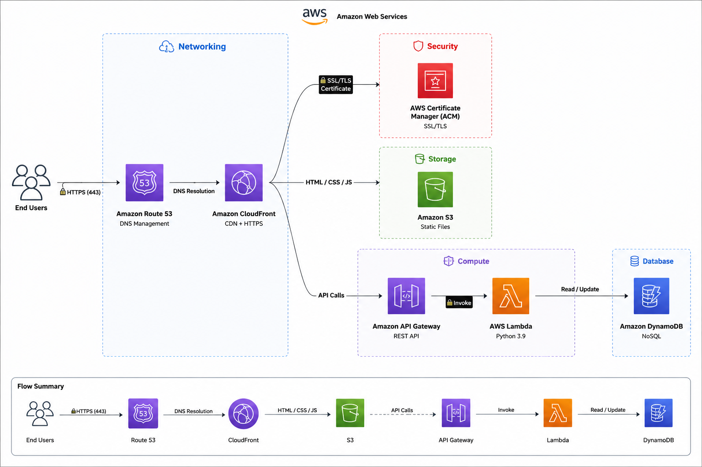
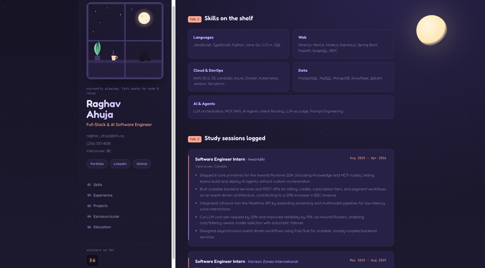

# Cloud Resume Challenge


## Table of Contents
- [Overview](#overview)
- [Architecture](#architecture)
- [Screenshots](#screenshots)
- [Quick Start](#quick-start)
- [Project Structure](#project-structure)
- [Technologies](#technologies)
- [CI/CD Pipeline](#cicd-pipeline)
- [Monitoring](#monitoring)
- [Security](#security)
- [Future Improvements](#future-improvements)
- [Troubleshooting](#troubleshooting)
- [Contributing](#contributing)
- [License](#license)

## Overview

This project is a serverless resume website built on AWS. It includes a static frontend, a visitor counter API, and infrastructure managed with Terraform.

Key components:
- Static website hosting with S3 and CloudFront
- Visitor counter with Lambda, API Gateway, and DynamoDB
- Infrastructure as code with Terraform remote state
- CI/CD with GitHub Actions
- Separate dev, staging, and production environments

Live demo: https://d35hputl9rebt8.cloudfront.net/

## Architecture



## Screenshots




## Quick Start

### Prerequisites

- Terraform 1.5 or later
- AWS CLI 2.x
- Python 3.9 or later
- Git
- Node.js 16 or later for frontend builds

### 1. Clone the repository

```bash
git clone https://github.com/yourusername/cloud-resume-challenge.git
cd cloud-resume-challenge
```

### 2. Configure AWS credentials

```bash
aws configure
```

### 3. Bootstrap the Terraform backend

```bash
cd terraform/environments/dev
terraform init
terraform apply -target=module.backend
```

### 4. Deploy the infrastructure

```bash
terraform plan -var-file="dev.tfvars"
terraform apply -var-file="dev.tfvars" -auto-approve
```

### 5. Verify the deployment

```bash
curl https://dev.resume.your-domain.com
curl https://api.your-domain.com/visitor-count
aws logs describe-log-groups --log-group-name-prefix /aws/lambda/resume
```

## Project Structure

```bash
cloud-resume-challenge/
├── backend/
│   └── visitor-counter/
├── frontend/
├── terraform/
│   ├── environments/
│   │   ├── dev/
│   │   ├── prod/
│   │   └── stage/
│   └── modules/
│       ├── acm/
│       ├── apigateway/
│       ├── cloudfront/
│       ├── dynamodb/
│       ├── iam/
│       ├── lambda/
│       ├── networking/
│       ├── route53/
│       └── s3/
└── README.md
```

## Technologies

### AWS Services

- S3 for static website hosting
- CloudFront for CDN and HTTPS
- Route 53 for DNS and domain management
- ACM for TLS certificates
- API Gateway for the visitor counter API
- Lambda for serverless compute
- DynamoDB for visitor count storage
- CloudWatch for logging and monitoring
- IAM for access control

### Tools and Frameworks

- Terraform for infrastructure as code
- GitHub Actions for CI/CD
- Python for the Lambda function
- HTML, CSS, and JavaScript for the frontend

## CI/CD Pipeline

The pipeline is organized into these stages:

1. Format and validation checks with `terraform fmt` and `terraform validate`
2. Security scanning with `tfsec`
3. Terraform planning for dev, staging, and production
4. Automated deployment to dev
5. Automated deployment to staging
6. Manual approval before production deployment

## Monitoring

- CloudWatch logs for Lambda execution
- CloudWatch dashboards for operational visibility
- Alarms for service health and error tracking

## Security

- Least-privilege IAM roles and policies
- TLS termination through CloudFront and ACM
- Environment isolation across dev, staging, and production
- Terraform-managed infrastructure for consistent configuration

## Future Improvements

- Add automated tests for the backend function
- Expand observability with more granular CloudWatch metrics
- Add deployment previews for feature branches
- Improve frontend accessibility and performance audits

## Troubleshooting

If deployment fails, check the following first:

- AWS credentials and account permissions
- Terraform backend configuration
- CloudWatch logs for Lambda errors
- API Gateway and DynamoDB permissions

## Contributing

1. Fork the repository
2. Create a feature branch
3. Commit your changes
4. Push the branch
5. Open a pull request

## License

This project is licensed under the MIT License. See the LICENSE file for details.


